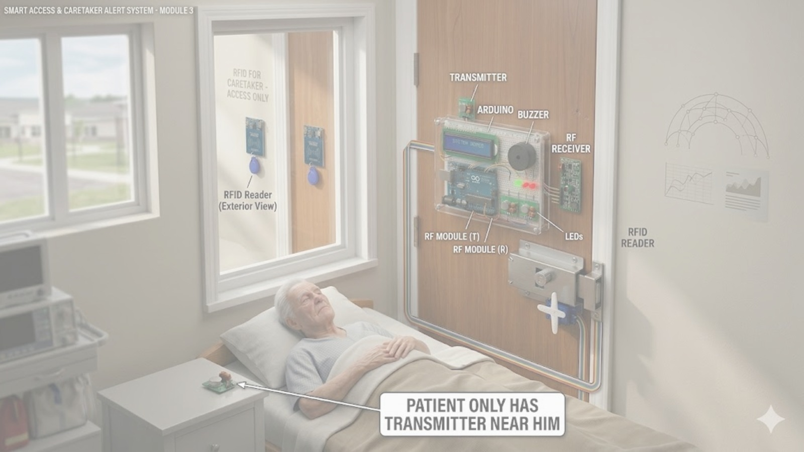
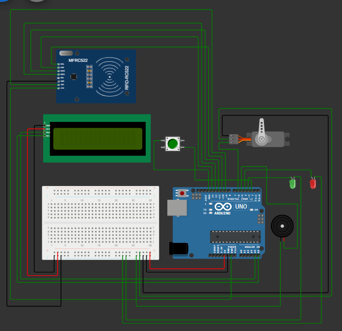
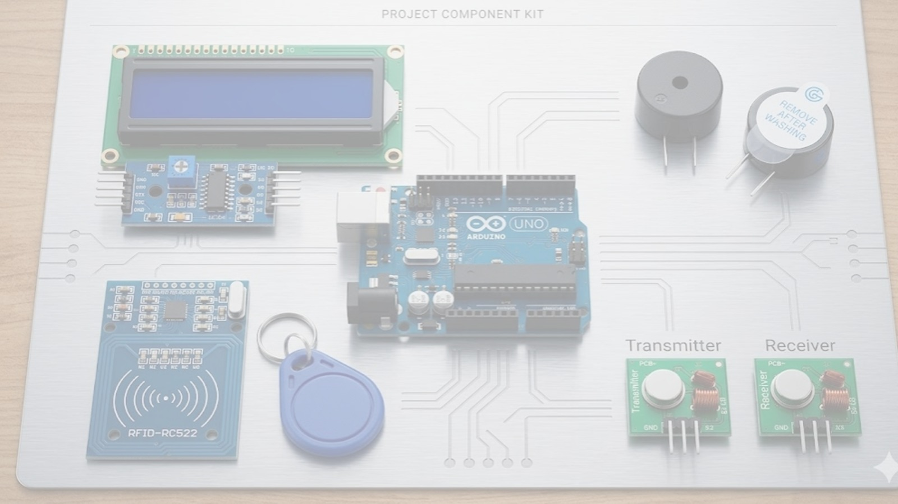

# RFID-Based Smart Door Lock System

A security door lock system built for my Digital Logic Design (COMP 206) final project. It combines RFID authentication with a finite state machine (FSM) design, simulated in both **Wokwi** (Arduino-level simulation) and **Logisim Evolution** (gate-level logic design).

The system was designed with a specific use case in mind: a caregiver-access door lock for a bedridden patient, where access can be granted either by scanning an authorized RFID card or by pressing a remote button (for the patient/caregiver on the inside).



*AI-generated visualization of the intended real-world deployment scenario.*

---

## How It Works

**Access flow:**
1. System idles in a "Secured" state, LCD displays `System Secured / Scan Card`.
2. Access can be triggered two ways:
   - An RFID card is scanned and matched against a stored authorized UID
   - The remote/patient button is pressed directly
3. On a match: green LED turns on, a confirmation beep sounds, the servo unlatches the door for a fixed clearance window, then automatically re-locks.
4. On a mismatch: red LED and buzzer alarm trigger and the system locks into an alarm state until manually reset via the button.

**Logic design (Logisim):**
The core comparator/lock logic was modeled as a 3-state FSM:
- **Locked** (default/secured state)
- **Unlocked** (servo open, timer running)
- **Alarm** (mismatch detected, held until reset)

State transitions are driven by an XNOR-based UID comparator (checks scanned bits against the stored authorized code) and D flip-flops hold the current state between clock cycles. A counter implements the 5-second auto-relock timer so the system returns to Locked automatically instead of staying open indefinitely.

---

## Visuals



*Wokwi wiring diagram showing the RFID reader, LCD, servo, LEDs, buzzer, and button connected to the Arduino Uno.*

### Concept Illustration
*AI-generated visualizations of the intended real-world use case and component kit.*



---

## Components Used

| Component | Purpose |
|---|---|
| Arduino UNO | Main controller |
| MFRC522 RFID Reader | Card/UID scanning |
| 16x2 I2C LCD | Status display |
| SG90 Servo Motor | Physical door latch |
| Green + Red LEDs | Access granted / denied indicators |
| Buzzer | Confirmation beep + alarm siren |
| Push Button | Manual remote access / alarm reset |

### Complete Hardware Architecture & Pin Mapping

| Component Category | Component | Pin Label | Connect To (Arduino/Breadboard) | Notes |
| :--- | :--- | :--- | :--- | :--- |
| **Logic & Data** | I2C LCD 16x2 | GND | Breadboard GND (-) | Common Ground |
| | | VCC | Breadboard 5V (+) | |
| | | SDA | Analog Pin A4 | I2C Data Line |
| | | SCL | Analog Pin A5 | I2C Clock Line |
| **Authentication** | MFRC522 RFID Reader | VCC | Arduino 3.3V Pin | **Warning: 3.3V ONLY!** |
| | | RST | Digital Pin D9 | Reset |
| | | GND | Breadboard GND (-) | Common Ground |
| | | MISO | Digital Pin D12 | SPI Pin |
| | | MOSI | Digital Pin D11 | SPI Pin |
| | | SCK | Digital Pin D13 | SPI Pin |
| | | SDA (SS) | Digital Pin D10 | Slave Select |
| **Long Range** | 433MHz RF Receiver | VCC | Breadboard 5V (+) | |
| | | DATA | Digital Pin D2 | **MUST be D2 (Interrupt 0)** |
| | | GND | Breadboard GND (-) | Common Ground |
| **Indicators** | Green LED (D3) | Long Leg | Digital Pin D3 | |
| | Red LED (D4) | Long Leg | Digital Pin D4 | |
| | Active Buzzer (5V) | Positive Leg | Digital Pin D5 | Short leg to GND |
| **Mechanical Actuation** | SG90 Micro Servo Motor | Brown Wire | Breadboard GND (-) | Ground |
| | | Red Wire | Arduino 5V Pin | Power |
| | | Orange Wire | Digital Pin D6 | Servo PWM Signal |

---

## Repository Structure

```
├── rfid_door_lock.ino        # Arduino sketch (Wokwi simulation logic)
├── logisim/
│   └── door_lock_fsm.circ    # Logisim Evolution FSM (comparator + flip-flops + timer)
├── docs/
│   ├── circuit_diagram.png           # Wokwi wiring diagram
│   ├── project_poster.pdf            # Academic poster submitted for the course
│   ├── concept_component_kit.png     # AI-generated component kit visualization
│   └── concept_deployment_scene.png  # AI-generated deployment scenario visualization
└── README.md
```

---

## Tools Used
- **Wokwi** — Arduino hardware simulation
- **Logisim Evolution** — gate-level FSM design (XNOR comparator, D flip-flops, counter)
- **Arduino C++** (MFRC522, LiquidCrystal_I2C, Servo libraries)

---

## Running the Simulation

**Wokwi:**
- 🔗 [Click here to run the live interactive Wokwi simulation](https://wokwi.com/projects/467096717777538049) — no setup required, test it directly in your browser

Or run it manually:
1. Open [wokwi.com](https://wokwi.com), create a new Arduino Uno project
2. Paste `rfid_door_lock.ino` as the sketch
3. Wire components per `docs/circuit_diagram.png`
4. Install libraries: `MFRC522`, `LiquidCrystal I2C`, `Servo`
5. Run the simulation and scan the RFID card in the Wokwi UI

**Logisim:**
1. Open `logisim/door_lock_fsm.circ` in Logisim Evolution
2. Step through the clock to see state transitions between Locked → Unlocked → Alarm

---

## Known Limitations
- The auto-relock-to-Secured transition is not fully self-triggering in the current FSM implementation:
  - When access is granted via **RF Remote**, the system does not automatically return to the `System_Secured` state.
  - When access is granted via **Card Present**, the system only returns to `System_Secured` if the card is removed immediately after being scanned; otherwise it remains in the unlocked state.
  - The Arduino/Wokwi firmware version handles this correctly via a software-based 5-second timer (`delay()` call), so the physical simulation behaves as intended — this limitation is specific to the standalone Logisim FSM model.
- Future iteration: add a proper synchronous counter/timer circuit in Logisim so the FSM auto-transitions back to `Secured` regardless of input method, matching the firmware behavior exactly.

---

## Possible Improvements
- Support multiple authorized UIDs instead of a single hardcoded card
- Add an EEPROM log of access attempts (granted/denied + timestamp)
- Replace the fixed 5-second timer with a configurable delay

---

## Author
**Muhammad Haseeb Ul Hassan**
BSCS student, Forman Christian College University — Data Analytics & Mathematics minors
[LinkedIn](https://www.linkedin.com/in/muhammad-haseeb-ul-hassan-402041420)

*Built for COMP 206 – Digital Logic Design, Spring 2026*
